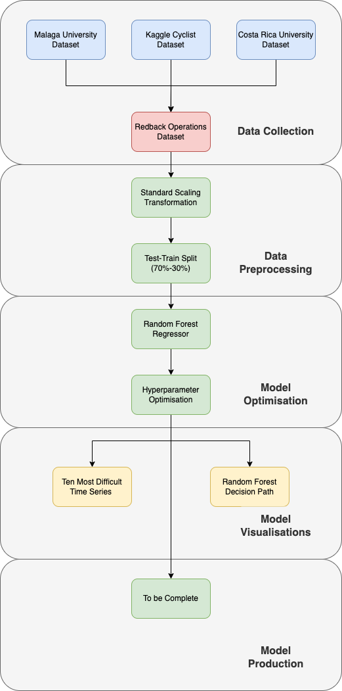
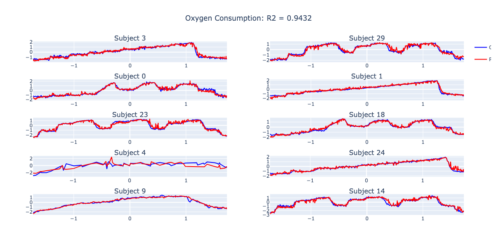

# Oxygen Uptake - Predicting VO2 using Heart Rate & Time

The following project takes several data sources combines them.

Once combined machine learning methods are applied in order to predict VO2.

## Results

X Axis - Standardised Time
Y Axis - Standardised VO2

## What's already been tested:
  - Min-Max Scaling
    - Decrease in performance
  - Robust Scaling
    - Decrease in performance
  - Additional Vairables
    - Hard to obtain or impractical
  - Long Short-Term Memory Model (LSTM)
    - Decrease in performance
    - Lack of model understanding
    - Inflexible to variations in time
  - XGBoost
    - Decrease in performance
  - Various Other Boosting Methods
    - Decrease in performance
  - Temporal Fusion Transformer (TFT)
    - Decrease in performance
    - Requires large amounts of computing resources

## Orignal Data Sources

Universtiy of Costa Rica Dataset:
  - Article : https://revistas.ucr.ac.cr/index.php/pem/article/view/41360 
  - Data Source : https://data.mendeley.com/datasets/vmwrtj29kr/1 

Kaggle Dataset:
  - Article & Data: https://www.kaggle.com/datasets/andreazignoli/cycling-vo2 

University of Malaga Dataset:
  - Article: https://www.tandfonline.com/doi/abs/10.1080/15438627.2021.1954513?journalCode=gspm20 
  - Data: https://physionet.org/content/treadmill-exercise-cardioresp/1.0.1/ 
