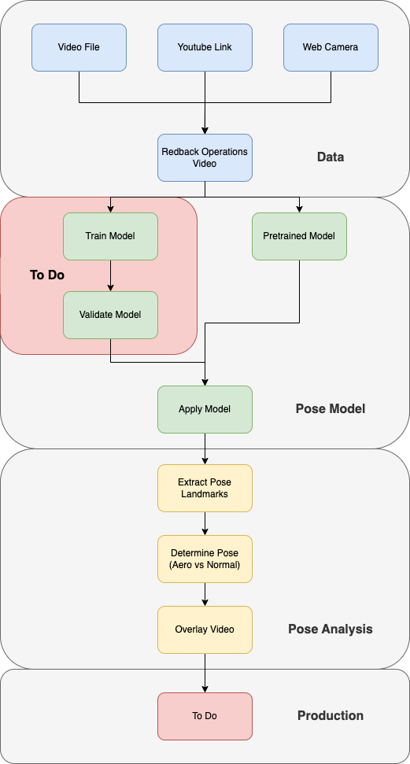

# Oxygen Uptake - Predicting VO2 using Heart Rate & Time

## Guide

Click Me !!!

## Workflow

The following project accepts several different types of data sources.

Regardless of data source, a pretrained model is applied to determine/extract pose landmark coordinates.

Specific landmarks are then used to determine certains types of posture during cycling.

## Results

Normal Position - Click Me !!!

Aero Position - Click Me !!!

## What's already been tested:
  - Mediapipe
    - Model Complexity (0,1 & 2)
